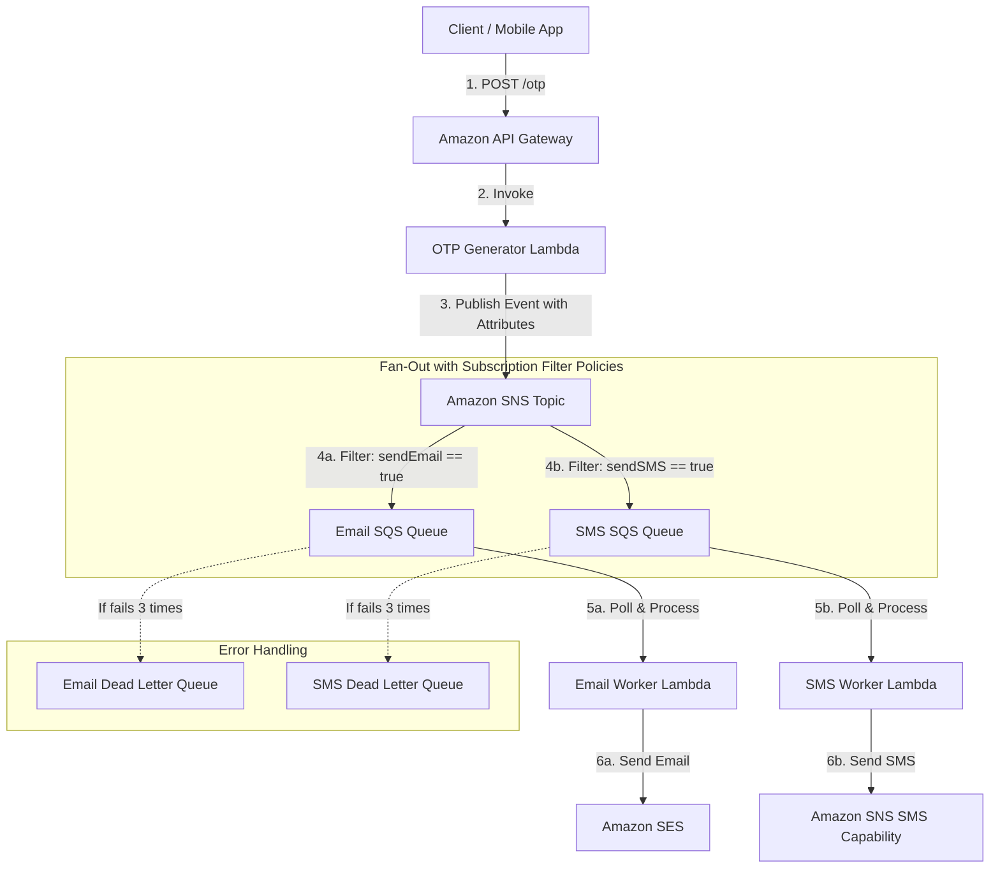

# Amazon SNS Fan-out Architecture with SQS & Lambda

This project demonstrates a reliable OTP (One-Time Password) generation and delivery architecture using **AWS CDK in TypeScript**. It showcases the Amazon SNS fan-out pattern with SQS queues acting as buffer queues for workers to deliver OTPs via Email (SES) and SMS (SNS SMS).

---

## 📐 Architecture Flow



1. **Request**: The user requests an OTP by making a `POST /otp` request containing their `email` and/or `phoneNumber` to the **API Gateway** endpoint.
2. **Generation**: The **OTP Generator Lambda** generates a secure random 6-digit OTP code, logs it for verification/testing, and publishes the event message to the **SNS Topic**.
3. **Routing (Filter Policies)**:
   * If the payload has `email`, the event contains the `sendEmail: "true"` message attribute. The **Email SQS Queue** filters and receives this message.
   * If the payload has `phoneNumber`, the event contains the `sendSMS: "true"` message attribute. The **SMS SQS Queue** filters and receives this message.
   * If both are present, the event is fanned out to both queues.
4. **Reliability**: Both queues have Dead Letter Queues (DLQs). If the workers fail to process/send the message after 3 attempts, it is automatically routed to the respective DLQ to isolate failures.
5. **Workers**:
   * The **Email Worker Lambda** polls the Email Queue and uses **Amazon SES** to send the email.
   * The **SMS Worker Lambda** polls the SMS Queue and uses **Amazon SNS SMS** to send the SMS message.

---

## 🛠️ Requirements & Setup

Before deploying, ensure you have the following ready in your AWS account (due to default Sandbox restrictions):

### 1. Amazon SES (Email)
* Log in to the AWS Console, search for **Amazon Simple Email Service**.
* Go to **Verified Identities** and click **Create Identity**.
* Add the email address you wish to send emails **from** (e.g. `sender@yourdomain.com`).
* **If your SES account is in Sandbox mode**, you must also verify any **recipient** email addresses you plan to test with.

### 2. Amazon SNS SMS (SMS)
* **If your SNS SMS account is in SMS Sandbox mode** (default in most regions), go to the **Amazon SNS Console** -> **Sandbox destination phone numbers**.
* Add and verify the phone number(s) you wish to send test SMS messages to.

---

## 🚀 Commands

* `npm run build`   Compile TypeScript to JS.
* `npm run test`    Run Jest unit tests to verify CDK structure.
* `npx cdk synth`   Synthesize the CloudFormation template.
* `npx cdk deploy`  Deploy this stack to your AWS account.

### Deploying with your verified Email:
To specify your verified sender email address, deploy using the `SenderEmail` parameter:
```bash
npx cdk deploy --parameters SenderEmail="your-verified-sender@example.com"
```

---

## 🧪 Testing the Flow

Once deployed, CDK will print the output variables:
* `ApiGatewayUrl`: The REST endpoint to post requests.
* `EmailQueueUrl` & `SmsQueueUrl`: The SQS Queue endpoints.

Use `curl` or Postman to test the endpoint:

### 1. Requesting Email OTP Only
```bash
curl -X POST <ApiGatewayUrl> \
  -H "Content-Type: application/json" \
  -d '{"email": "your-verified-recipient@example.com"}'
```
* **Expected Routing**: SNS routes the event only to the **Email SQS Queue**. The Email Worker delivers the email.

### 2. Requesting SMS OTP Only
```bash
curl -X POST <ApiGatewayUrl> \
  -H "Content-Type: application/json" \
  -d '{"phoneNumber": "+1234567890"}'
```
* **Expected Routing**: SNS routes the event only to the **SMS SQS Queue**. The SMS Worker delivers the text.

### 3. Requesting Both (Fan-out)
```bash
curl -X POST <ApiGatewayUrl> \
  -H "Content-Type: application/json" \
  -d '{"email": "your-verified-recipient@example.com", "phoneNumber": "+1234567890"}'
```
* **Expected Routing**: SNS fans out the message to **both** queues. Both workers send their respective OTP deliveries.
